# MeetingNote

> **회의가 끝나면 정리도 끝나 있게.** 녹음 파일 하나를 올리면 받아쓰고, **요약 · 결정사항 · 할 일** 세 갈래로 나눠 저장하는 회의록 정리 웹 앱입니다.

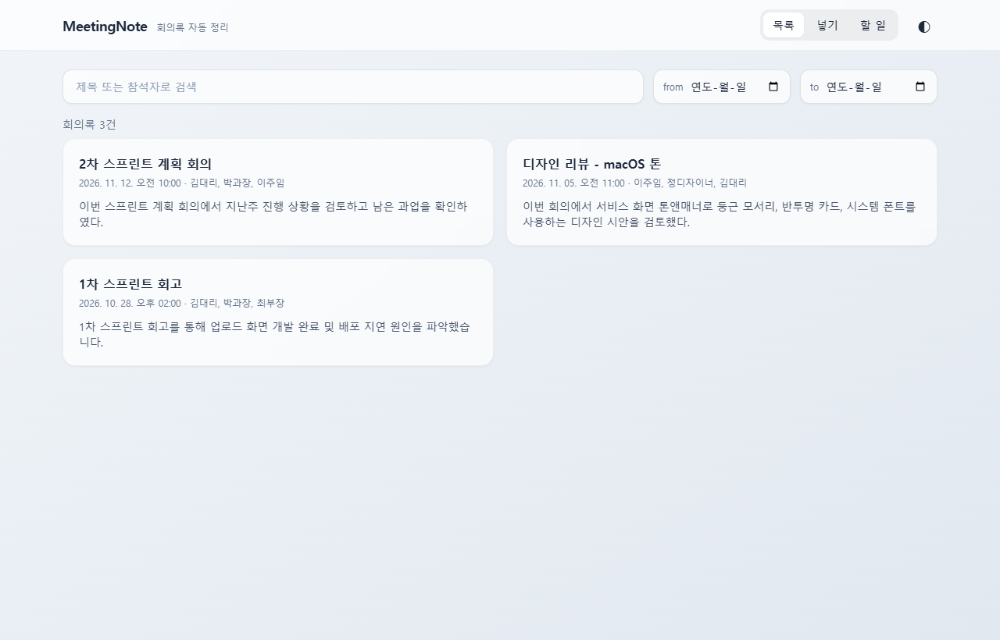

| 백엔드 | 프론트 | DB | 받아쓰기 · 정리 | 테스트 |
|---|---|---|---|---|
| FastAPI · Python 3.11+ | Vanilla JS · Tailwind CDN | SQLite (SQLAlchemy) | Gemini `gemini-3.1-flash-lite` | pytest (실제 Gemini 호출) |

---

## 목차

1. [무엇을 해결하나](#1-무엇을-해결하나)
2. [주요 기능](#2-주요-기능)
3. [화면 둘러보기](#3-화면-둘러보기)
4. [전체 구조](#4-전체-구조)
5. [동작 흐름 (시퀀스 다이어그램)](#5-동작-흐름-시퀀스-다이어그램)
6. [세 갈래 구분 규칙](#6-세-갈래-구분-규칙)
7. [데이터 모델](#7-데이터-모델)
8. [REST API](#8-rest-api)
9. [시작하기](#9-시작하기)
10. [테스트](#10-테스트)
11. [폴더 구조](#11-폴더-구조)
12. [설계 문서](#12-설계-문서)

---

## 1. 무엇을 해결하나

주 3회 이상 회의에 들어가는 실무자는 「그때 뭐라고 했더라」를 자주 겪습니다.
MeetingNote 는 녹음을 올리면 **받아쓰기 → 세 갈래 정리 → 저장**까지 한 번에 끝내고,
나중에 **제목 · 참석자 · 날짜**로 다시 찾을 수 있게 합니다. 개발자가 아닌 사람도 쓸 수 있게 화면은 4개뿐입니다.

## 2. 주요 기능

| # | 기능 | 내용 |
|---|---|---|
| 1 | 회의 내용 넣기 | 녹음 파일(mp3 · wav, 25MB 이하)을 올리거나 메모를 붙여넣기 |
| 2 | 세 갈래 정리 | 본문을 **요약 / 결정사항 / 할 일**로 나눔. 할 일은 `내용 \| 담당자 \| 기한` |
| 3 | 회의록 CRUD | 추가 · 목록 · 제목 수정 · 삭제를 모두 화면에서 |
| 4 | 검색 | 제목 · 참석자 부분 일치, 날짜 범위 (로컬 날짜 기준, 양끝 포함) |
| 5 | 할 일 모아 보기 | 여러 회의의 할 일을 담당자 · 기한과 함께 표로 |
| 6 | 테마 | 라이트 / 다크 토글. 처음엔 OS 설정을 따르고, 고른 값은 `localStorage` 에 기억 |
| 7 | 모바일 | 360px 폭에서도 깨지지 않음. 할 일 화면은 표만 가로 스크롤 |

## 3. 화면 둘러보기

화면은 **목록 · 넣기 · 상세 · 할 일** 4종이고, 배치는 [`docs/화면구성.pdf`](docs/화면구성.pdf) 를 따릅니다.
UI 는 macOS 톤(둥근 모서리 · 부드러운 그림자 · 반투명 카드 · 시스템 폰트)입니다.

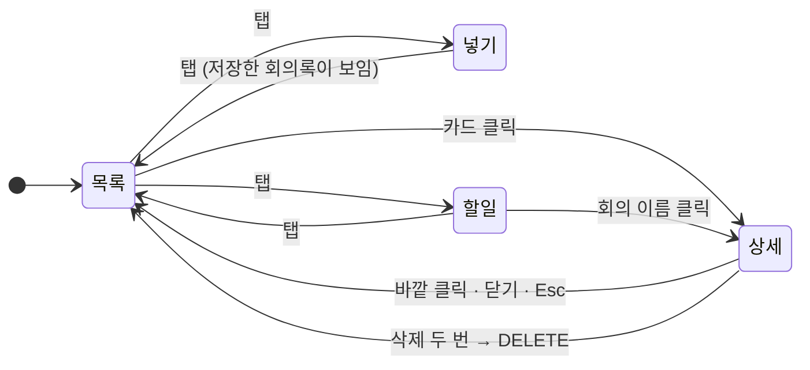
```mermaid
stateDiagram-v2
    direction LR
    [*] --> 목록
    목록 --> 넣기: 탭
    넣기 --> 목록: 탭 (저장한 회의록이 보임)
    목록 --> 할일: 탭
    할일 --> 목록: 탭
    목록 --> 상세: 카드 클릭
    할일 --> 상세: 회의 이름 클릭
    상세 --> 목록: 바깥 클릭 · 닫기 · Esc
    상세 --> 목록: 삭제 두 번 → DELETE
```

### 3-1. 넣기 - 녹음에서 세 갈래까지

| ① 파일을 고르고 「받아쓰기」 | ② 받아쓴 본문이 채워짐 |
|---|---|
| 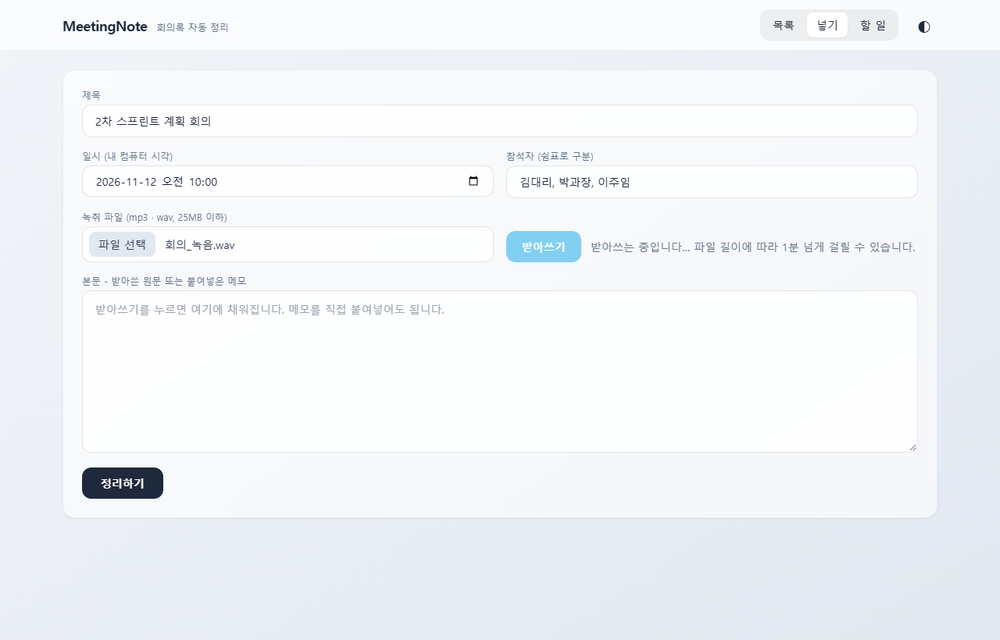 | 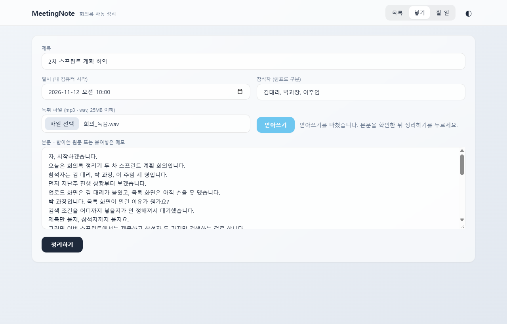 |

③ 「정리하기」를 누르면 저장되고, 세 칸이 바로 보입니다.

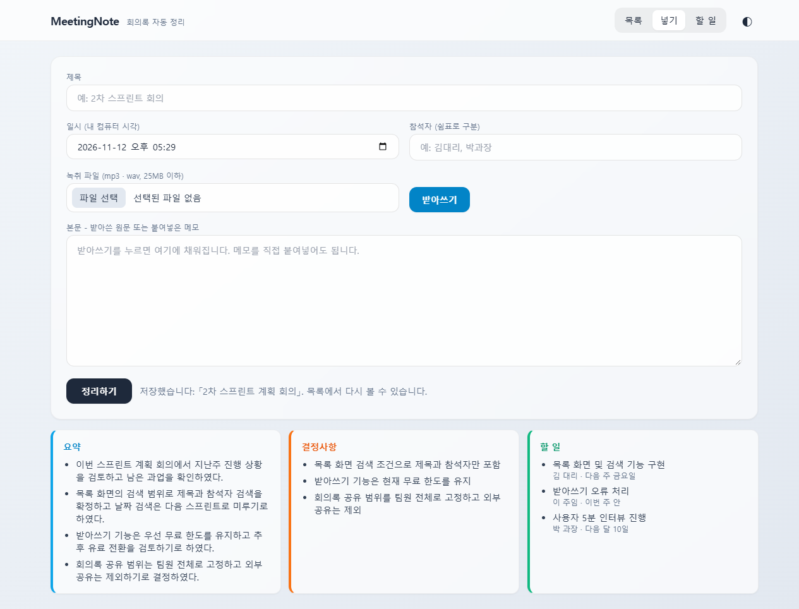

- 일시(`#metAt`)는 내 컴퓨터 시각으로 넣고, 보낼 때 **UTC 로 바꿔** 보냅니다. 받을 때는 다시 로컬 시각으로 보여 줍니다
- 본문이 20자 미만이거나 회의 내용이 아니면 세 칸 대신 **「구분 실패」** 안내가 나옵니다 (본문은 그대로 저장)
- 400 · 413 · 415 · 502 같은 오류는 버튼 옆 상태 문구에 한국어로 안내합니다

### 3-2. 목록 · 검색

입력할 때마다 다시 검색합니다. 아래는 참석자 `이주임` 으로 찾은 결과입니다.

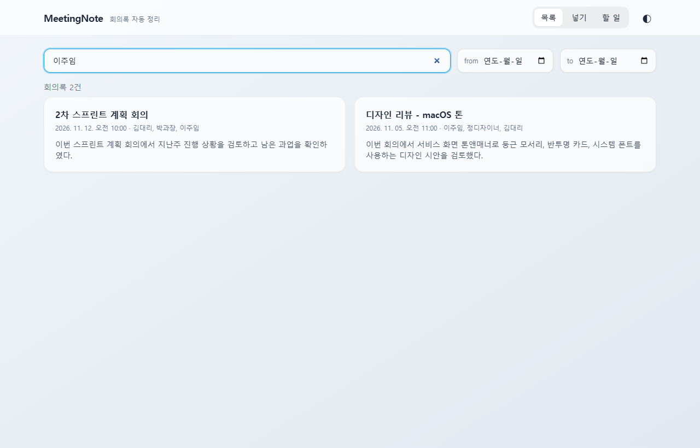

### 3-3. 상세 - 제목 수정 · 두 번 눌러 삭제

| 상세 창 | 삭제를 한 번 누른 상태 |
|---|---|
| 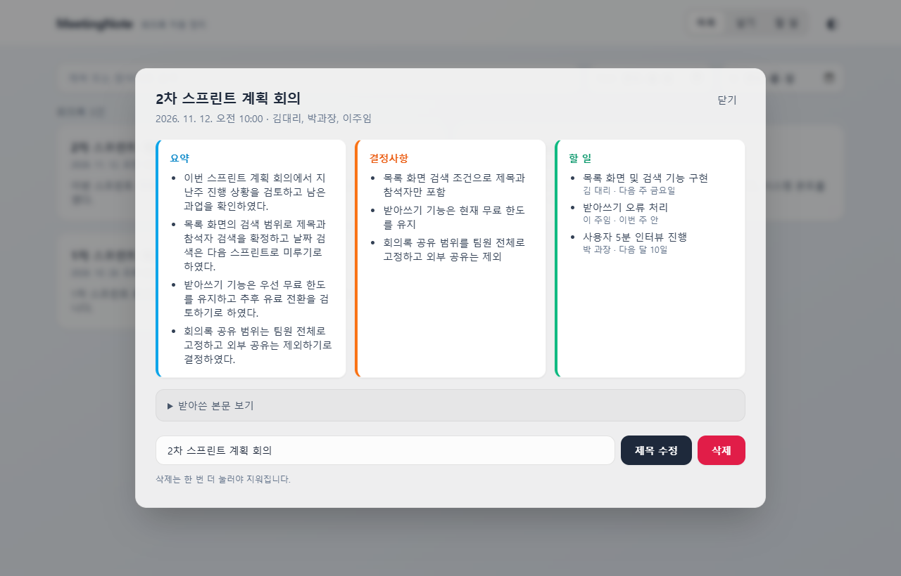 | 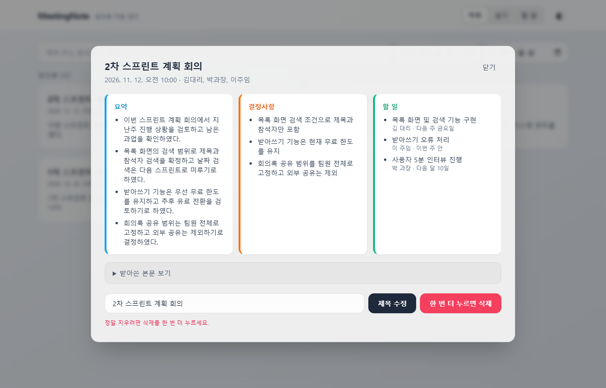 |

- 바깥 어두운 영역을 누르면 닫힙니다
- 「받아쓴 본문 보기」는 접혀 있습니다
- 삭제는 **한 번 더 눌러야** 실제로 지워집니다

### 3-4. 할 일

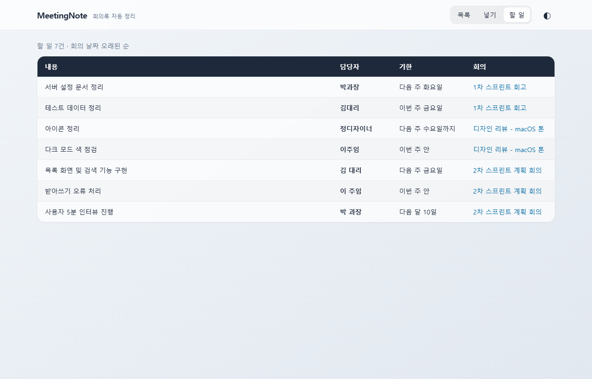

기한은 회의에서 말한 그대로(「다음 주 금요일」) 둡니다. 날짜로 바꾸거나 기한으로 정렬하지 않고, **회의 날짜 오래된 순**으로 보여 줍니다.

### 3-5. 다크 모드

| 목록 | 상세 |
|---|---|
| 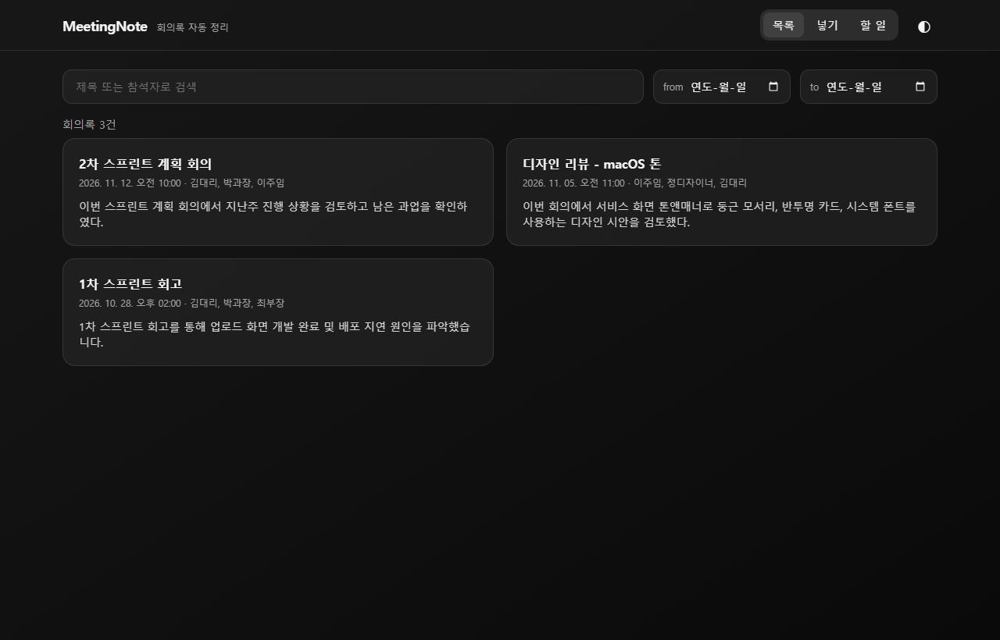 | 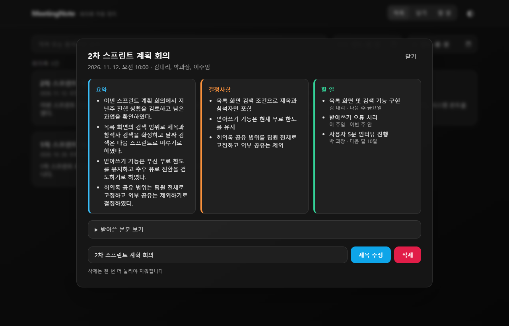 |

### 3-6. 모바일 (360px)

| 목록 (카드 1열) | 할 일 (표만 가로 스크롤) |
|---|---|
| 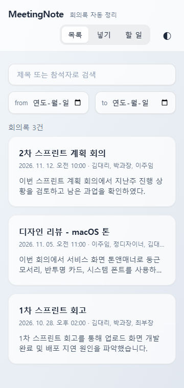 | 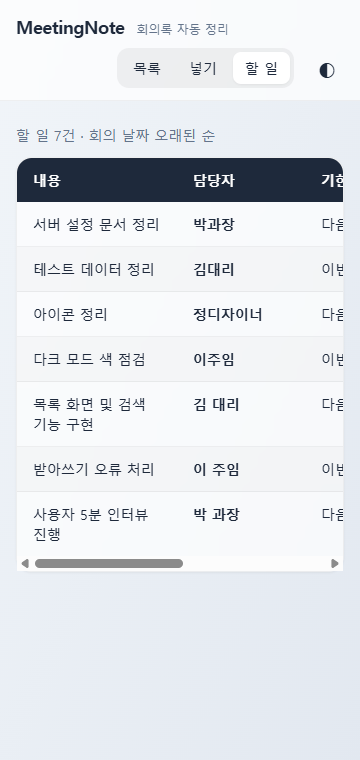 |

### 3-7. API 문서 (Swagger UI)

서버를 띄우면 `http://localhost:8000/docs` 에서 API 7개를 바로 시험해 볼 수 있습니다.

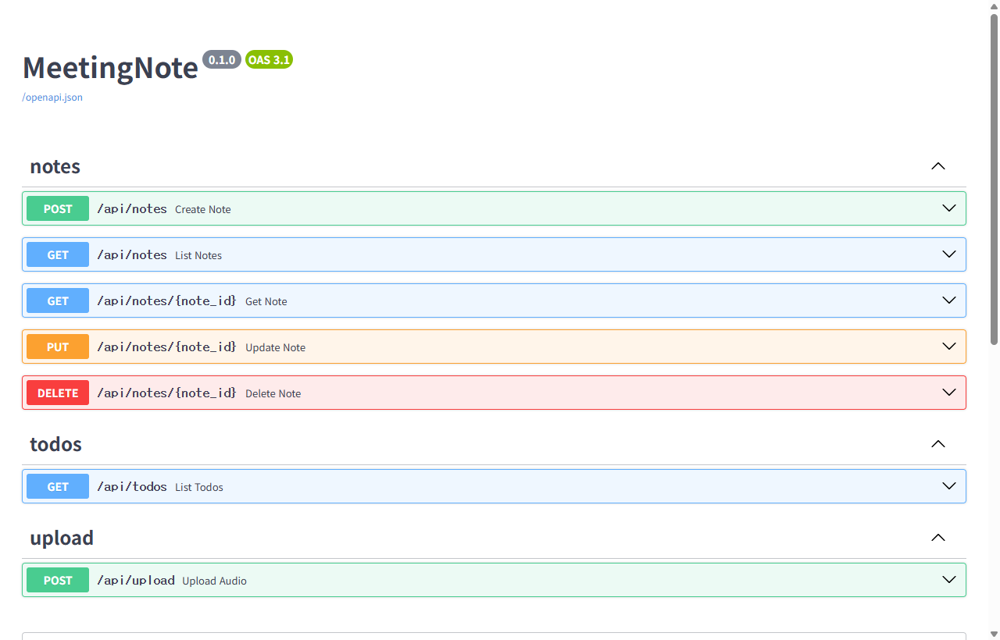

## 4. 전체 구조

백엔드가 `/api/*` 와 화면 파일(`frontend/`)을 **같은 오리진(8000)** 에서 함께 제공합니다. 그래서 CORS 설정이 필요 없고, `file://` 로 열지 않습니다.

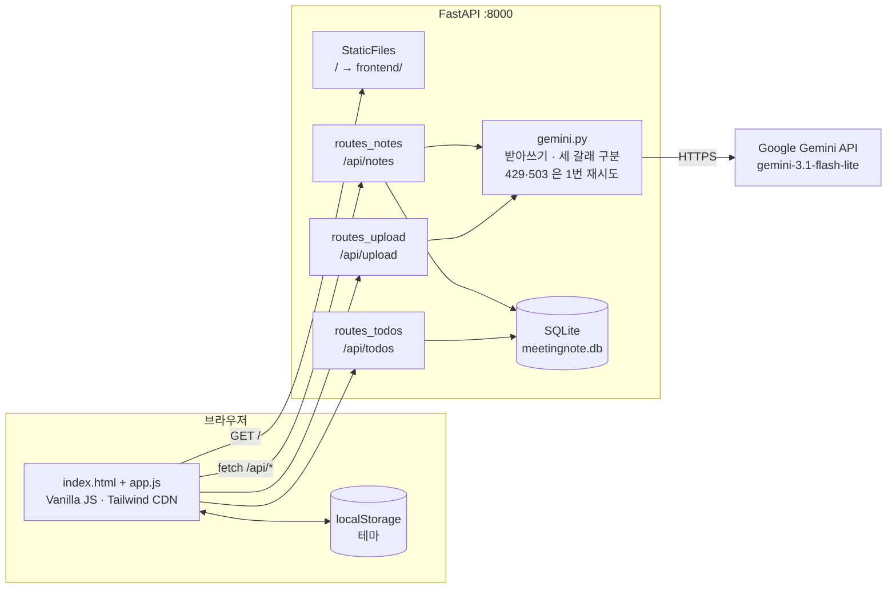
```mermaid
flowchart LR
    subgraph Browser["브라우저"]
        UI["index.html + app.js<br/>Vanilla JS · Tailwind CDN"]
        LS[("localStorage<br/>테마")]
        UI <--> LS
    end

    subgraph Server["FastAPI :8000"]
        direction TB
        Static["StaticFiles<br/>/ → frontend/"]
        Notes["routes_notes<br/>/api/notes"]
        Todos["routes_todos<br/>/api/todos"]
        Upload["routes_upload<br/>/api/upload"]
        Gem["gemini.py<br/>받아쓰기 · 세 갈래 구분<br/>429·503 은 1번 재시도"]
        DB[("SQLite<br/>meetingnote.db")]
        Notes --> Gem
        Upload --> Gem
        Notes --> DB
        Todos --> DB
    end

    Gemini["Google Gemini API<br/>gemini-3.1-flash-lite"]

    UI -- "GET /" --> Static
    UI -- "fetch /api/*" --> Notes
    UI --> Todos
    UI --> Upload
    Gem -- "HTTPS" --> Gemini
```

## 5. 동작 흐름 (시퀀스 다이어그램)

### 5-1. 녹음 올리기 → 받아쓰기

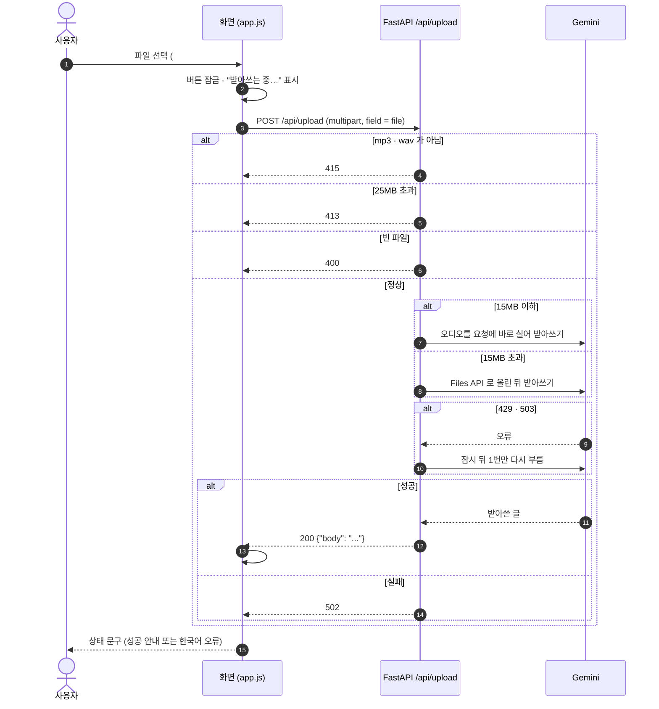
```mermaid
sequenceDiagram
    autonumber
    actor U as 사용자
    participant F as 화면 (app.js)
    participant A as FastAPI /api/upload
    participant G as Gemini

    U->>F: 파일 선택 (#file) 후 「받아쓰기」(#btnUp)
    F->>F: 버튼 잠금 · "받아쓰는 중…" 표시
    F->>A: POST /api/upload (multipart, field = file)
    alt mp3 · wav 가 아님
        A-->>F: 415
    else 25MB 초과
        A-->>F: 413
    else 빈 파일
        A-->>F: 400
    else 정상
        alt 15MB 이하
            A->>G: 오디오를 요청에 바로 실어 받아쓰기
        else 15MB 초과
            A->>G: Files API 로 올린 뒤 받아쓰기
        end
        alt 429 · 503
            G-->>A: 오류
            A->>G: 잠시 뒤 1번만 다시 부름
        end
        alt 성공
            G-->>A: 받아쓴 글
            A-->>F: 200 {"body": "..."}
            F->>F: #body 채우기
        else 실패
            A-->>F: 502
        end
    end
    F-->>U: 상태 문구 (성공 안내 또는 한국어 오류)
```

### 5-2. 정리하기 → 저장 + 세 갈래 구분

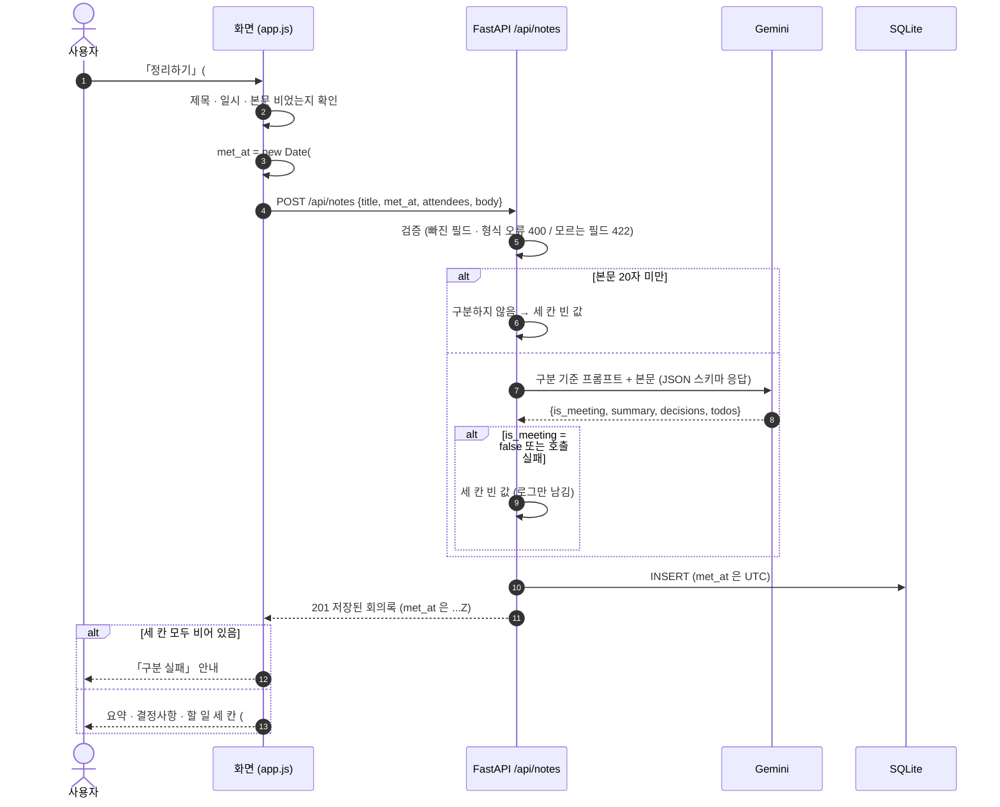
```mermaid
sequenceDiagram
    autonumber
    actor U as 사용자
    participant F as 화면 (app.js)
    participant N as FastAPI /api/notes
    participant G as Gemini
    participant D as SQLite

    U->>F: 「정리하기」(#btnSave)
    F->>F: 제목 · 일시 · 본문 비었는지 확인
    F->>F: met_at = new Date(#metAt).toISOString() (로컬 → UTC)
    F->>N: POST /api/notes {title, met_at, attendees, body}
    N->>N: 검증 (빠진 필드 · 형식 오류 400 / 모르는 필드 422)
    alt 본문 20자 미만
        N->>N: 구분하지 않음 → 세 칸 빈 값
    else
        N->>G: 구분 기준 프롬프트 + 본문 (JSON 스키마 응답)
        G-->>N: {is_meeting, summary, decisions, todos}
        alt is_meeting = false 또는 호출 실패
            N->>N: 세 칸 빈 값 (로그만 남김)
        end
    end
    N->>D: INSERT (met_at 은 UTC)
    N-->>F: 201 저장된 회의록 (met_at 은 ...Z)
    alt 세 칸 모두 비어 있음
        F-->>U: 「구분 실패」 안내
    else
        F-->>U: 요약 · 결정사항 · 할 일 세 칸 (#result)
    end
```

### 5-3. 검색

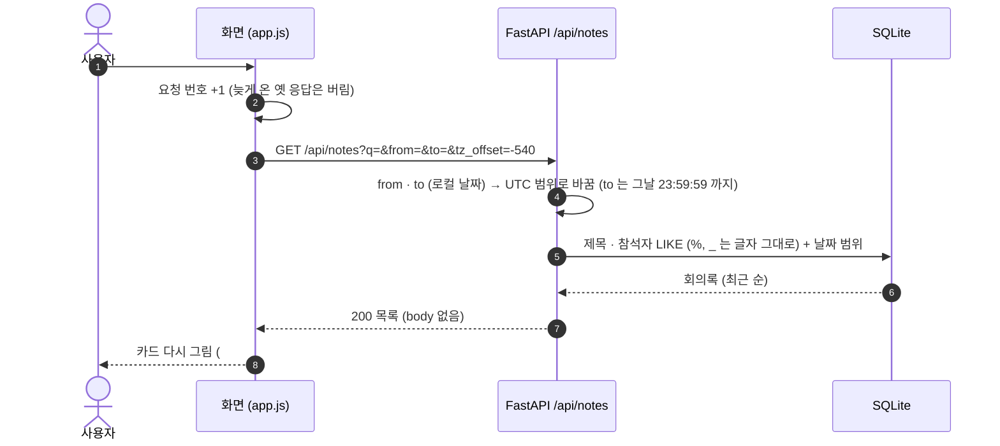
```mermaid
sequenceDiagram
    autonumber
    actor U as 사용자
    participant F as 화면 (app.js)
    participant N as FastAPI /api/notes
    participant D as SQLite

    U->>F: #q · #from · #to 에 입력 (input 이벤트마다)
    F->>F: 요청 번호 +1 (늦게 온 옛 응답은 버림)
    F->>N: GET /api/notes?q=&from=&to=&tz_offset=-540
    N->>N: from · to (로컬 날짜) → UTC 범위로 바꿈 (to 는 그날 23:59:59 까지)
    N->>D: 제목 · 참석자 LIKE (%, _ 는 글자 그대로) + 날짜 범위
    D-->>N: 회의록 (최근 순)
    N-->>F: 200 목록 (body 없음)
    F-->>U: 카드 다시 그림 (#cards)
```

### 5-4. 상세 - 제목 수정 · 삭제

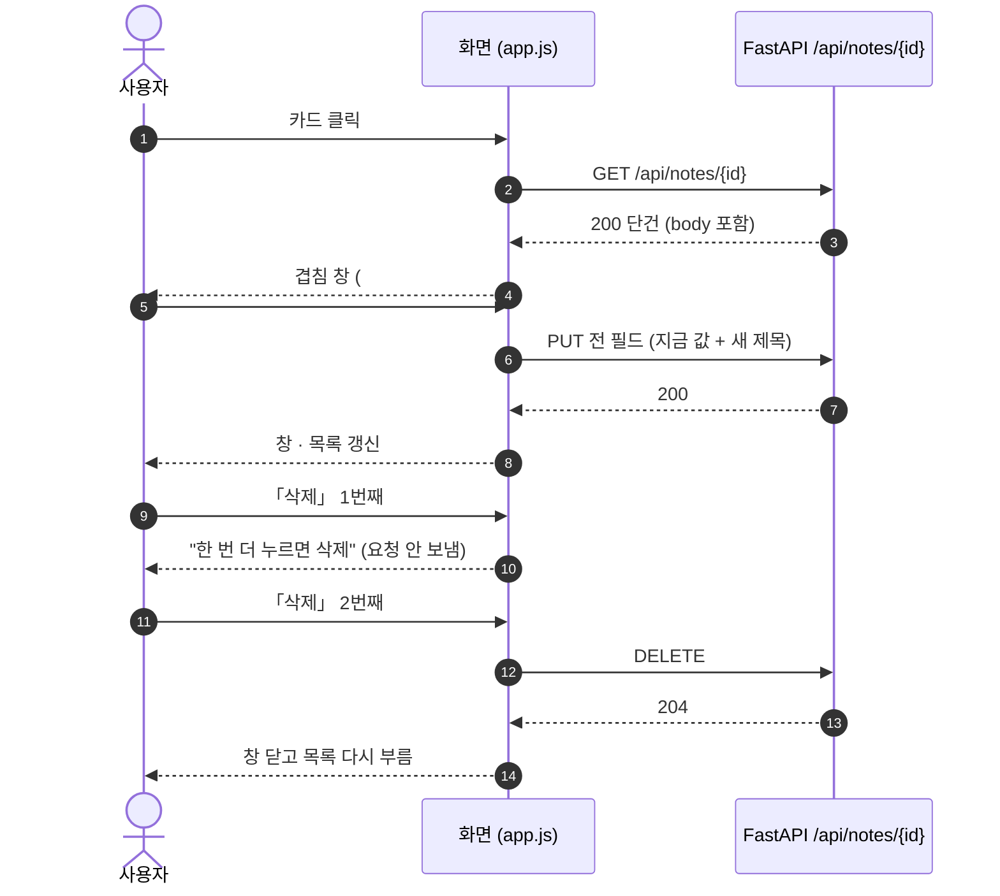
```mermaid
sequenceDiagram
    autonumber
    actor U as 사용자
    participant F as 화면 (app.js)
    participant N as FastAPI /api/notes/{id}

    U->>F: 카드 클릭
    F->>N: GET /api/notes/{id}
    N-->>F: 200 단건 (body 포함)
    F-->>U: 겹침 창 (#modal)

    U->>F: #mTitle 고친 뒤 「제목 수정」
    F->>N: PUT 전 필드 (지금 값 + 새 제목)
    N-->>F: 200
    F-->>U: 창 · 목록 갱신

    U->>F: 「삭제」 1번째
    F-->>U: "한 번 더 누르면 삭제" (요청 안 보냄)
    U->>F: 「삭제」 2번째
    F->>N: DELETE
    N-->>F: 204
    F-->>U: 창 닫고 목록 다시 부름
```

## 6. 세 갈래 구분 규칙

아래 기준이 **그대로** Gemini 프롬프트에 들어갑니다.

| 칸 | 기준 |
|---|---|
| **요약** | 회의 전체를 3~5줄로. 새로운 사실을 지어내지 않음 |
| **결정사항** | 「하기로 했다 / 확정 / 승인」처럼 합의가 끝난 것만. 논의만 한 것은 넣지 않음 |
| **할 일** | 담당자와 기한이 드러난 것만. 담당자가 없으면 `미정` |
| (버림) | 셋 중 어디에도 안 들어가는 잡담 |

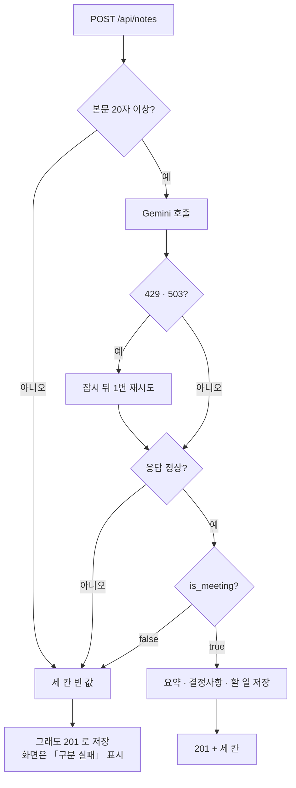
```mermaid
flowchart TD
    A["POST /api/notes"] --> B{"본문 20자 이상?"}
    B -- 아니오 --> E["세 칸 빈 값"]
    B -- 예 --> C["Gemini 호출"]
    C --> R{"429 · 503?"}
    R -- 예 --> C2["잠시 뒤 1번 재시도"] --> P
    R -- 아니오 --> P{"응답 정상?"}
    P -- 아니오 --> E
    P -- 예 --> M{"is_meeting?"}
    M -- false --> E
    M -- true --> S["요약 · 결정사항 · 할 일 저장"]
    E --> Z["그래도 201 로 저장<br/>화면은 「구분 실패」 표시"]
    S --> Y["201 + 세 칸"]
```

## 7. 데이터 모델

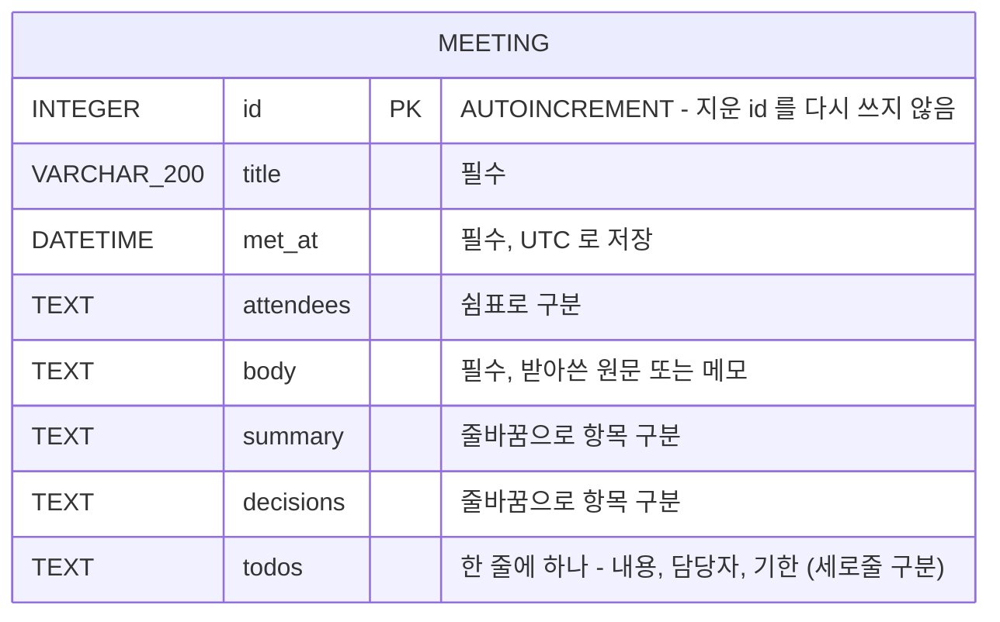
```mermaid
erDiagram
    MEETING {
        INTEGER id PK "AUTOINCREMENT - 지운 id 를 다시 쓰지 않음"
        VARCHAR_200 title "필수"
        DATETIME met_at "필수, UTC 로 저장"
        TEXT attendees "쉼표로 구분"
        TEXT body "필수, 받아쓴 원문 또는 메모"
        TEXT summary "줄바꿈으로 항목 구분"
        TEXT decisions "줄바꿈으로 항목 구분"
        TEXT todos "한 줄에 하나 - 내용, 담당자, 기한 (세로줄 구분)"
    }
```

`todos` 저장 예:

```
목록 화면과 검색 기능 구현 | 김대리 | 다음 주 금요일
받아쓰기 오류 처리 | 이주임 | 이번 주 안
```

## 8. REST API

모든 경로는 `/api/` 로 시작합니다.

| # | 메서드 · 경로 | 성공 | 하는 일 |
|---|---|---|---|
| 1 | `POST /api/notes` | 201 | 저장하면서 세 갈래 구분 |
| 2 | `GET /api/notes?q=&from=&to=&tz_offset=` | 200 | 목록 · 검색 (`body` 없음) |
| 3 | `GET /api/notes/{id}` | 200 | 단건 (`body` 포함) |
| 4 | `PUT /api/notes/{id}` | 200 | 수정 (전 필드) |
| 5 | `DELETE /api/notes/{id}` | 204 | 삭제 |
| 6 | `GET /api/todos` | 200 | 할 일 모아 보기 (`what` · `who` · `when` · `note_id` · `note_title`) |
| 7 | `POST /api/upload` | 200 | 녹음 → 본문 텍스트 `{"body": "..."}` |

| 상황 | 코드 | 화면 안내 |
|---|---|---|
| 제목 · 일시 · 본문 없음, 형식 오류 | 400 | 입력값을 확인해 주세요 |
| 없는 id | 404 | 회의록을 찾을 수 없습니다 |
| 스펙에 없는 필드 | 422 | 알 수 없는 항목이 들어 있습니다 |
| 업로드 파일이 25MB 초과 | 413 | 25MB 이하 파일만 올릴 수 있습니다 |
| 업로드 파일이 mp3 · wav 아님 | 415 | mp3 · wav 파일만 올릴 수 있습니다 |
| 받아쓰기 외부 호출 실패 | 502 | 받아쓰기 서비스에 연결하지 못했습니다 |

**시각 처리** - 서버는 `met_at` 을 UTC 로 저장하고 `...Z` 를 붙여 돌려줍니다. 화면은 보낼 때 로컬 → UTC, 보여 줄 때 UTC → 로컬로 바꿉니다.
날짜 검색의 `from` · `to` 는 로컬 날짜이고, 화면이 `tz_offset`(JS `getTimezoneOffset()`, 한국은 `-540`)을 함께 보내 서버가 차이를 맞춥니다.

## 9. 시작하기

### 준비물

- Python 3.11 이상
- Gemini API 키

### 설치 · 실행

```bash
# 1) 프로젝트 루트에 .env 를 만든다 (저장소에 올리지 않음)
cat > .env <<'EOF'
GEMINI_API_KEY=여기에_키
GEMINI_MODEL=gemini-3.1-flash-lite
EOF

# 2) 가상환경과 의존성 (8개 고정)
cd backend
python -m venv .venv
.venv/Scripts/pip install -r requirements.txt      # macOS · Linux: .venv/bin/pip

# 3) 서버 실행 - 포트 8000 고정
.venv/Scripts/python -m uvicorn main:app --port 8000
```

브라우저에서 **http://localhost:8000** 을 엽니다. API 문서는 **http://localhost:8000/docs** 입니다.

- 키가 없으면 서버가 뜨지 않고 `.env` 에 키를 넣으라는 오류를 냅니다
- DB 파일은 기본 `backend/meetingnote.db` 이고, `MEETINGNOTE_DB` 환경 변수로 바꿀 수 있습니다

### 의존성 (사전 승인 8개)

`fastapi` · `uvicorn` · `sqlalchemy` · `pytest` · `httpx` · `google-genai` · `python-multipart` · `python-dotenv`

프론트는 설치할 것이 없습니다. Tailwind 는 CDN 으로 읽고, 빌드 단계도 없습니다.

## 10. 테스트

```bash
cd backend
.venv/Scripts/python -m pytest -q tests/
```

- **실제 Gemini 를 부릅니다.** 대역(mock)으로 바꾸지 않습니다. 받아쓰기 · 구분이 진짜 되는지는 실제로 불러 봐야 알 수 있기 때문입니다
- 요청 한도에 걸리지 않게 Gemini 를 부르는 테스트는 호출 사이를 1초 띄웁니다
- 테스트는 따로 만든 DB 파일을 쓰므로 실제 회의록은 건드리지 않습니다
- 케이스 목록(테스트 매트릭스)은 [`docs/05-conventions.md`](docs/05-conventions.md) 에 있습니다

## 11. 폴더 구조

```
metingnote/
├── backend/
│   ├── main.py            # 진입점. /api 라우터 + frontend/ 정적 제공
│   ├── config.py          # .env 읽기, 상수 (25MB, 20자, 포트)
│   ├── database.py        # SQLite 엔진 · 세션
│   ├── models.py          # Meeting (8필드, AUTOINCREMENT)
│   ├── schemas.py         # 요청 · 응답 스키마 (extra="forbid", UTC 변환)
│   ├── errors.py          # 검증 실패 → 400, 스펙 외 필드만 422
│   ├── gemini.py          # 받아쓰기 · 세 갈래 구분 · 재시도
│   ├── routes_notes.py    # /api/notes
│   ├── routes_todos.py    # /api/todos
│   ├── routes_upload.py   # /api/upload
│   ├── requirements.txt
│   └── tests/             # pytest
├── frontend/
│   ├── index.html         # 화면 4종 (Tailwind CDN)
│   └── app.js             # 상태는 모듈 변수, DOM 직접 갱신
└── docs/                  # 설계 문서 6종 + 화면구성.pdf + 스크린샷
```

화면 요소 id 는 [`docs/화면구성.pdf`](docs/화면구성.pdf) 5쪽 표를 그대로 씁니다:
`q` · `from` · `to` · `cards` · `title` · `metAt` · `attendees` · `file` · `body` · `btnUp` · `btnSave` · `result` · `modal` · `mTitle` · `todoBody`

## 12. 설계 문서

읽는 순서는 `00` → `05` 입니다.

| 문서 | 내용 |
|---|---|
| [`00-overview.md`](docs/00-overview.md) | 전체 안내, 화면 4종, 관심사 분리 |
| [`01-product.md`](docs/01-product.md) | 목표 · 페르소나 · MVP 범위 · 성공 기준 |
| [`02-specs.md`](docs/02-specs.md) | 데이터 모델 · API · 검색 · 오류 코드 · 실패 처리 |
| [`03-design.md`](docs/03-design.md) | 기술 결정 8가지와 트레이드오프, 요소 id 표 |
| [`04-tasks.md`](docs/04-tasks.md) | Phase 3개 · 단계별 검증 방법 |
| [`05-conventions.md`](docs/05-conventions.md) | 명명 · 금지 6개 · 테스트 매트릭스 · 커밋 규칙 |
